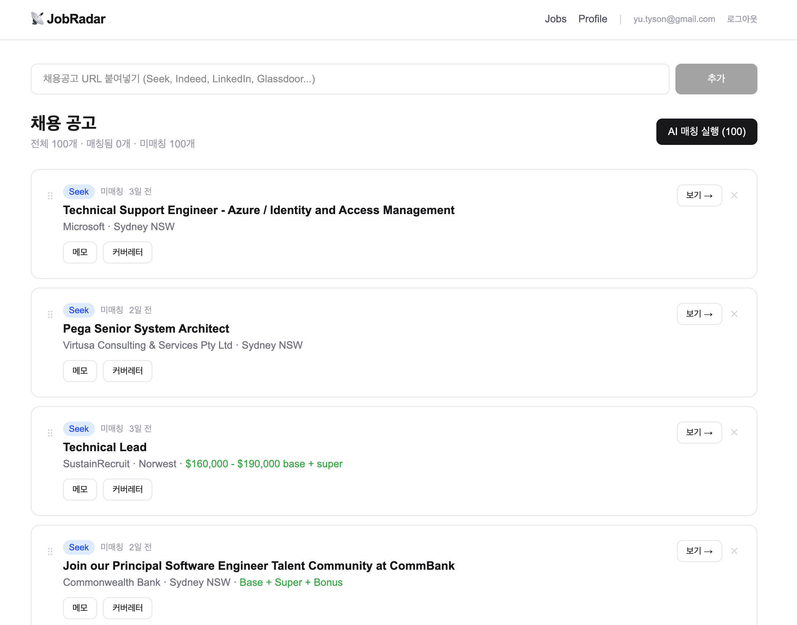
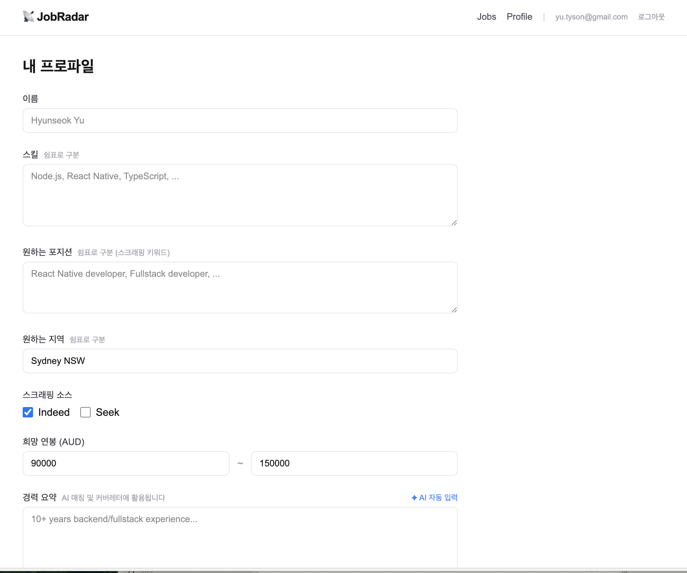
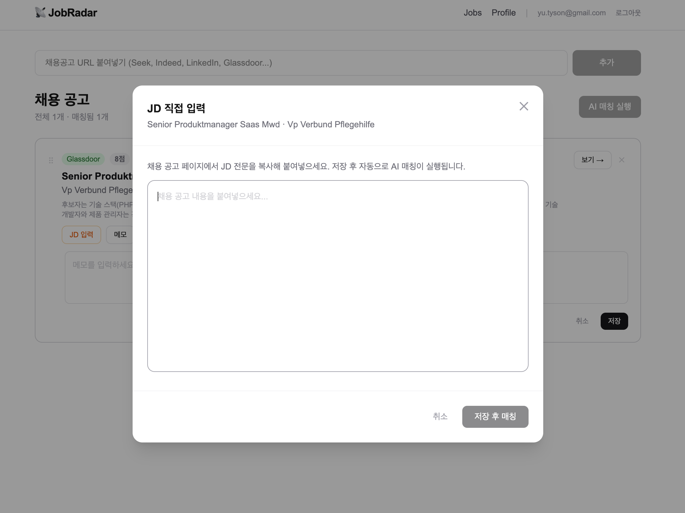
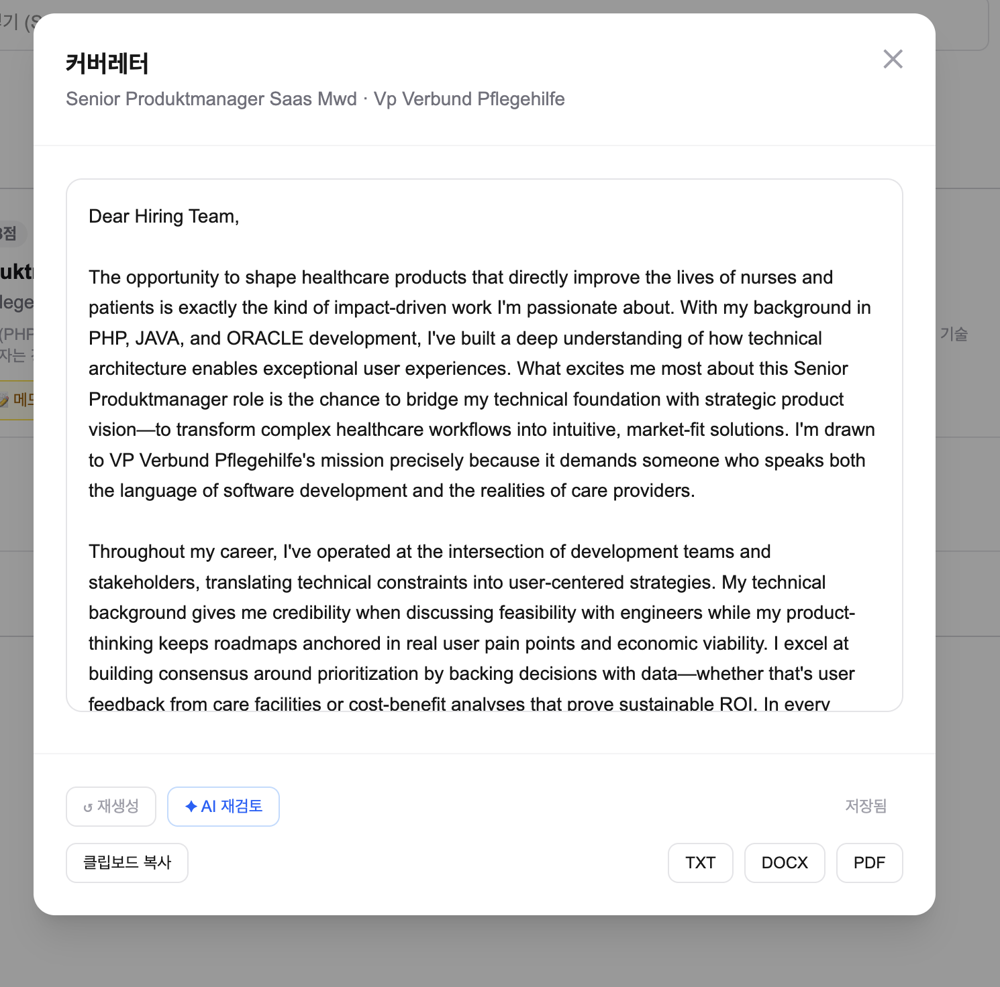

# JobRadar

**AI-powered job matching & cover letter automation for IT job seekers across Australia, Europe, North America, and beyond.**

> Paste a job URL → AI scores your fit → generates a tailored cover letter. All in one place.

- 🔗 **GitHub**: https://github.com/hyunseokyu1-netizen/jobradar
- 📅 **Built**: April 2026 –
- 🛠️ **Type**: Personal full-stack project (pair-programmed with Claude Code)

---

## Screenshots

### Job List — AI Match Scores & Status Tracking


### Profile — Resume & Preferences


### JD Input — Paste Job Description Manually


### Cover Letter — AI Generation & Korean Translation


---

## Features

### Job Management
- Add any job posting by URL (Seek, Indeed, LinkedIn, Glassdoor, etc.)
- Platform badge per source, salary display, posted-time label
- Drag-and-drop reorder
- Manual JD paste for sites that block scraping (e.g. Glassdoor)
- Per-job memo (private, per-user)

### AI Matching (Claude API)
- Scores each job 0–100 based on your profile vs. the JD
- Factors: skill overlap, seniority fit, position alignment, salary range
- Korean summary of match reason
- One-click re-match after editing JD or profile

### Application Status Tracking
| Status | Meaning |
|--------|---------|
| Unclassified | Not reviewed yet |
| ⭐ Interested | Worth a closer look |
| 🤔 Considering | On the fence |
| ✓ Applied | Application submitted |
| 📅 Interview | Interview scheduled |
| 🎉 Accepted | Offer received |
| ✕ Rejected | Not selected |
| — Pass | Decided not to apply |

### Cover Letter Generation
- AI writes a 300-word English cover letter tailored to the JD + your resume
- AI review mode: polishes grammar and phrasing
- Korean translation tab: side-by-side language comparison
- Export as TXT, DOCX, or PDF

### User Profile
- Skills, desired positions, preferred locations
- Salary range with currency selector (AUD / USD / EUR / KRW / JPY / NZD / GBP / SGD)
- Career summary with AI auto-fill from uploaded resume
- Resume upload (PDF / DOCX → auto text extraction)

---

## Tech Stack

| Layer | Technology |
|-------|-----------|
| Framework | Next.js 14 App Router + TypeScript |
| Styling | Tailwind CSS |
| Database | Supabase (PostgreSQL + Row Level Security) |
| Auth | Supabase Auth (Google OAuth) |
| AI | Claude API — Haiku model (Anthropic) |
| Scraping | Playwright |
| Deployment | Vercel |
| DnD | @dnd-kit |
| Export | docx, jsPDF |

---

## Architecture

```
User
 │
 ▼
Next.js (Vercel)
 ├── App Router Pages
 │     ├── /          — Job list
 │     └── /profile   — User profile
 │
 ├── Server Actions
 │     ├── Job CRUD + URL scraping
 │     ├── AI matching         (Claude API)
 │     ├── Cover letter gen/review/translate (Claude API)
 │     └── Status & memo management
 │
 └── Supabase (PostgreSQL)
       ├── profiles      — resume, skills, preferences (per user)
       ├── jobs          — shared job pool
       ├── matches       — score, status, memo (per user × job)
       └── cover_letters — generated letters (per user × job)
```

**Multi-user data isolation**: All queries use `supabaseAdmin` (service role) but apply explicit `user_id` filters at the code level. Supabase RLS acts as a secondary safeguard.

---

## Key Engineering Notes

**PostgREST embedded filter bug with service role**
`matches!inner` + `.eq('matches.user_id', ...)` was silently ignored when using the service role key. Fixed by splitting into two queries: fetch `matches` by `user_id` first, then fetch `jobs` by the resulting `job_id` list.

**Cover letter data isolation fix**
Upsert was keyed on `job_id` only — last writer won across users. Added `UNIQUE (user_id, job_id)` constraint and updated all CRUD to include `user_id`.

**Shared column anti-pattern**
`jobs.memo` was a shared column visible to all users. Moved to `matches.memo` (per-user) via DB migration.

---

## Local Setup

```bash
git clone https://github.com/hyunseokyu1-netizen/jobradar.git
cd jobradar
npm install
cp .env.example .env.local   # fill in Supabase + Anthropic keys
npm run dev
```

Required environment variables:

```
NEXT_PUBLIC_SUPABASE_URL=
NEXT_PUBLIC_SUPABASE_ANON_KEY=
SUPABASE_SERVICE_ROLE_KEY=
ANTHROPIC_API_KEY=
```

---

---

# JobRadar (한국어)

**호주·유럽·북미 등 해외 취업을 준비하는 IT 개발자를 위한 AI 채용 매칭 & 커버레터 자동화 웹앱.**

> 채용공고 URL만 붙여넣으면 AI가 내 이력서와 매칭해서 점수를 매기고, 맞춤 커버레터까지 자동으로 작성해준다.

---

## 왜 만들었나

해외 취업 준비를 하면서 매번 반복되는 작업이 너무 비효율적이었다.

- Seek·Indeed·Glassdoor를 돌아다니며 공고를 일일이 확인
- "이 공고가 나한테 맞나?" 직접 읽고 판단
- 공고마다 커버레터를 처음부터 새로 작성
- 지원 상태를 엑셀로 따로 관리

이 모든 걸 하나의 앱에서 자동화하고 싶었다.

---

## 주요 기능

### 채용공고 관리
- URL 한 줄로 공고 추가 (Seek, Indeed, LinkedIn, Glassdoor 등)
- 플랫폼 배지, 급여 표시, 등록 시간 표시
- 드래그로 순서 재정렬
- 스크래핑이 안 되는 사이트는 JD 텍스트 직접 붙여넣기

### AI 매칭 (Claude API)
- 내 프로파일 vs JD를 분석해 0~100점으로 채점
- 스킬 일치도·경력 수준·포지션 적합도·연봉 범위 반영
- 매칭 이유를 한국어로 요약 표시

### 지원 상태 관리
드롭다운으로 상태 선택: **미분류 → 관심있음 → 고민중 → 지원완료 → 면접 → 합격 / 불합격 / 패스**

### AI 커버레터
- 이력서 + JD 기반 300단어 영문 커버레터 자동 생성
- AI 재검토로 어색한 표현 자동 수정
- 한국어 번역 탭에서 영문·한국어 비교
- TXT / DOCX / PDF 다운로드

### 내 프로파일
- 스킬, 희망 포지션, 희망 지역
- 희망 연봉 + 통화 선택 (AUD / USD / EUR / KRW / JPY 등)
- 이력서 업로드 → 텍스트 자동 추출 → 경력 요약 AI 자동 작성

---

## 기술 스택

| 영역 | 기술 |
|------|------|
| 프레임워크 | Next.js 14 App Router + TypeScript |
| 스타일 | Tailwind CSS |
| DB | Supabase (PostgreSQL + RLS) |
| 인증 | Supabase Auth (Google OAuth) |
| AI | Claude API — Haiku 모델 |
| 스크래핑 | Playwright |
| 배포 | Vercel |

---

## 로컬 실행

```bash
git clone https://github.com/hyunseokyu1-netizen/jobradar.git
cd jobradar
npm install
cp .env.example .env.local   # Supabase + Anthropic 키 입력
npm run dev
```
